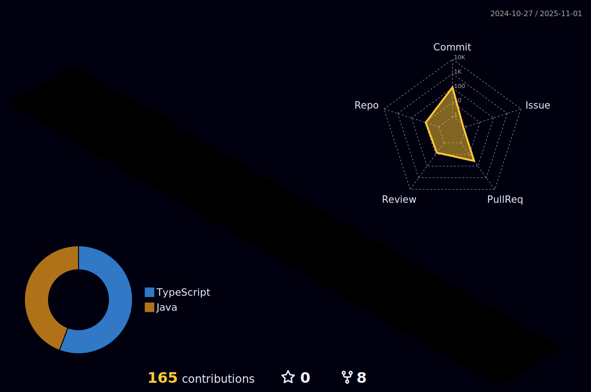

<!--  -->

<!-- <h1 align="center">Hi , I'm Bitsu</h1> -->

  <h2 align="center">I am glad you made it to my Github profile!</h2>
  

    

      <!--  -->
    
    

    

      

        I am a Software Engineer that is passionate about building remarkable Software. I have been programming since 2019. Over these years, I have gained exceptional knowledge in my area of expertise. I am a quick learner and a team player; I like creating close working relationships with my teammates and accommodating their needs for a greater connection. I believe I have a great work ethic that helps me fulfill my employer's needs and maintain excellent company-client relations. I love reaching the completion stage of every project I start and/or continue.
      

    

  

## You can connect with me at [LinkedIn](https://www.linkedin.com/in/bitsumamo)

<!-- TODO
  Change technologies layuout
-->

  <h2 align="center">Technologies</h2>
  <!--tech stack icons-->
  

    
  

<!--- stats & Trophy (start) -->

  <!--- stats (start) -->
  <table align="center">
  <tr border="0">
  <td width="50%" align="center">
    
    
      
     
  </td>

  <td width="50%" align="center">

    
    
    </td>
  </tr>
  </table>
  <!--- stats (end) -->

  <!--- trophy (start) -->
  

    
    
  

  

  

      
